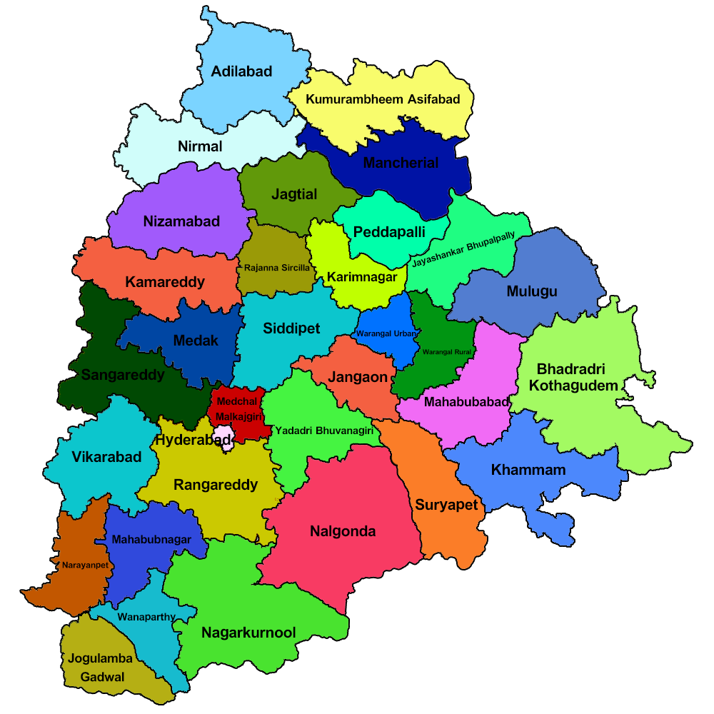

# CSP Assignment

## Key Concepts

**MRV (Minimum Remaining Values):** Selects the most constrained variable first — the one with the fewest legal values left. This prunes the search tree early and significantly reduces backtracking.

**Forward Checking:** After assigning a value to a variable, immediately removes that value from all unassigned neighbors' domains. If any neighbor's domain becomes empty, it backtracks right away without exploring further.

Together, MRV + Forward Checking make backtracking efficient enough to solve even the 81-variable Sudoku quickly.

A **Constraint Satisfaction Problem (CSP)** is a mathematical framework where the goal is to find values for a set of variables such that all defined constraints are satisfied. CSPs are widely used in AI for scheduling, planning, puzzle solving, and resource allocation.

Every problem here is modeled with three components:

| Component | Description |
|-----------|-------------|
| **Variables** | The entities to be assigned values (states, cells, letters) |
| **Domains** | The set of possible values for each variable |
| **Constraints** | Rules that restrict which values can be assigned together |

### Algorithm

All four problems share a single `solve()` function implementing:

- **Backtracking Search** — systematically tries values, undoes bad choices when a conflict is reached
- **MRV Heuristic** — always picks the variable with the fewest remaining legal values first, reducing the search space
- **Forward Checking** — after each assignment, prunes invalid values from neighboring variables' domains and backtracks immediately if any domain becomes empty

---
# Problems Implemented

## 1. Australia Map Coloring

**File:** `australia.py`

Color the 7 states and territories of Australia so that no two adjacent regions share the same color.

**States:** WA, NT, SA, Queensland, NSW, V, T  
**Colors used:** 4 (Red, Green, Blue, Yellow)

**Sample Output:**
```
State           Color
-------------------------
  WA            Red
  NT            Green
  SA            Blue
  Queensland    Red
  NSW           Green
  V             Red
  T             Red

  All constraints satisfied! ✓
```

---

## 2. Telangana Map Coloring

**Files:** `telangana.py`, `telangana_map.py`, `telangana_district.geojson`, `telangana_map_output.png`

All **33 districts of Telangana** are coloured in a way that no two bordering districts share the same color.

The adjacency graph is based on actual district borders. Running `telangana_map.py` produces a rendered visual map saved as `telangana-map.png`.

**Map Output:**



**Run the map renderer:**
```bash
python telangana_map.py
```

---

## 3. Sudoku Puzzle

**Files:** `sodoku.py`, `sudoku_q.png`, `sudoku_a.png`

Solve a 9×9 Sudoku puzzle modeled as a CSP.

- **Variables:** Each of the 81 cells `(row, col)`
- **Domains:** Digits 1–9 (pre-filled cells get a singleton domain)
- **Constraints:** No two cells in the same row, column, or 3×3 box can share a value

**Puzzle (Question):**


**Solved:**


```
Solved Sudoku:
  7 8 5 | 4 3 9 | 1 2 6
  6 1 2 | 8 7 5 | 3 4 9
  4 9 3 | 6 2 1 | 5 7 8
  ------+-------+------
  8 5 7 | 9 4 3 | 2 6 1
  2 6 1 | 7 5 8 | 9 3 4
  9 3 4 | 1 6 2 | 7 8 5
  ------+-------+------
  5 7 8 | 3 9 4 | 6 1 2
  1 2 6 | 5 8 7 | 4 9 3
  3 4 9 | 2 1 6 | 8 5 7
```

---

## 4. Cryptarithmetic 

**File:** `cryparithmetic.py`

Assign a unique digit (0–9) to each letter such that the equation holds:

```
    S E N D
  + M O R E
  ---------
  M O N E Y
```

- **Variables:** S, E, N, D, M, O, R, Y
- **Constraints:** All digits must be unique; S ≠ 0 and M ≠ 0 (no leading zeros)

**Solution:**

| Letter | Digit |
|--------|-------|
| S | 9 |
| E | 5 |
| N | 6 |
| D | 7 |
| M | 1 |
| O | 0 |
| R | 8 |
| Y | 2 |

```
  9567 + 1085 = 10652  ✓
```

---

## Running the Code

**Requirements:** Python 3.x, `matplotlib`

```bash
python australia.py
python telangana.py
python sodoku.py
python cryparithmetic.py

# Generate the Telangana visual map
python telangana_map.py
```

---
